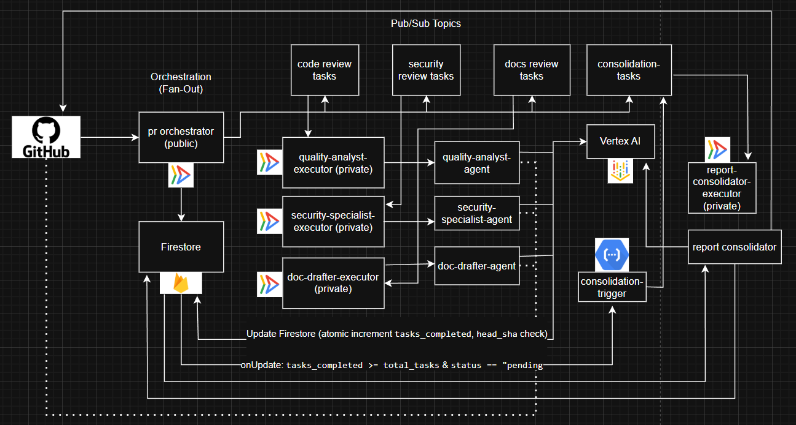

# GitHub Code Review Copilot

A serverless, multi-agent AI system that automatically reviews GitHub pull requests for code quality, security vulnerabilities, and documentation gaps.

This is a **headless B2D (Business-to-Developer) tool**. Its "frontend" is the GitHub pull request interface itself, posting synthesized reports as PR comments to meet developers exactly where they work.

---

## ▶️ Video Gallery
### 1. Project Introduction:

### 2. Project Implementation:

---

## 🧩 System Architecture Diagram

---

## 🧭 Detailed System Architecture Flow

## Stage 1: Orchestration (Fan-Out)
This is where the entire process begins.

### 1. GitHub Webhook Trigger:
**Action:** A developer creates or updates a Pull Request (PR) in GitHub.  
**Event:** GitHub sends a `pull_request` webhook event.

### 2. pr-orchestrator Service:
**Receives:** The GitHub webhook event.  
**Validates:** It verifies the `GITHUB_WEBHOOK_SECRET` to ensure the event is legitimate.  

**Initializes State:**  
**Action:** Creates a new document in Firestore.  
**Content:** This document stores the PR's `head_sha`, `pr_id`, `repo_owner`, `repo_name`, `status: "pending"`, and `total_tasks: 3`. This is crucial for tracking the review.

### 3. Task Fan-Out to Pub/Sub:
**Action:** `pr-orchestrator` prepares three separate "task payloads" (JSON strings containing PR info, SHA, etc.), one for each specialist agent.  
**Publishes:** It publishes these payloads to three distinct Pub/Sub topics.

---

## Stage 2: Specialist Execution (Triggering Agents)
This stage shows how the specialist agents are launched.

### 1. Executor Services:
- `quality-analyst-executor`
- `security-specialist-executor`
- `doc-drafter-executor`

**Listen:** Each executor service is configured with an Eventarc trigger that listens to one specific Pub/Sub topic (e.g., `quality-analyst-executor` listens to `code-review-tasks`).

### 2. Launching Agent Jobs:
**Receives:** An executor service receives a message from its Pub/Sub topic (via Eventarc).  
**Action:** It extracts the `TASK_PAYLOAD` from the Pub/Sub message.  
**Launches:** It then uses the Cloud Run Jobs API to start a new instance of its corresponding specialist Cloud Run Job, passing the `TASK_PAYLOAD` and the `GITHUB_TOKEN` as environment variables to the job.

- `quality-analyst`
- `security-specialist`
- `doc-drafter`

---

## Stage 3: Agent Work (Parallel Processing)
This is where the actual AI analysis happens concurrently.

### 1. Specialist Agent Jobs (`quality-analyst`, `security-specialist`, `doc-drafter`):
**Receives:** Each job starts and receives its specific `TASK_PAYLOAD` and `GITHUB_TOKEN`.

**Fetches Code:**  
**Action:** Uses the GitHub API (with `GITHUB_TOKEN`) to fetch file contents for the specified `head_sha`.  
**Fallback:** If the file is too large or API fails, it performs a shallow git clone.

**AI Analysis:**  
**Action:** Constructs a highly-specialized prompt based on its role (e.g., security, quality, docs) and the fetched code.  
**Calls:** Makes an API call to Vertex AI Gemini.

**Updates Firestore (Atomic Write):**  
**Action:** Writes its specific analysis results (e.g., `quality_analysis_results`, `security_analysis_results`, `docs_analysis_results`) back to the original Firestore document using an atomic transaction.  
**Crucial Detail:** This write atomically increments a `tasks_completed` counter in Firestore (e.g., from 0 to 1, then 1 to 2, then 2 to 3).  
**Resilience:** The write is conditional on the `head_sha` to prevent stale data.

---

## Stage 4: Consolidation (Fan-In)
This stage orchestrates the gathering of all results.

### 1. consolidation-trigger Cloud Function:
**Listens:** This function is triggered specifically by updates to Firestore documents.  

**Event Logic:**  
**Receives:** A Firestore document update event.  
**Checks:** It inspects the updated document:  
- Is `tasks_completed >= total_tasks`? (e.g., is it 3 or more?)  
- Is `status == "pending"`? (Has it not been consolidated yet?)  
**Locks:** If both conditions are true, it performs an atomic update to the Firestore document, setting `status: "consolidating"`. This "locks" the document to ensure the consolidation only runs once.

### 2. Publish Consolidation Task:
**Action:** If the `consolidation-trigger` successfully locks the document, it publishes a single message to the `consolidation-tasks` Pub/Sub topic. This message contains the Firestore document ID or relevant PR info.

### 3. report-consolidator-executor Service:
**Listens:** This service is configured with an Eventarc trigger that listens to the `consolidation-tasks` Pub/Sub topic.  
**Launches:** It launches the `report-consolidator` Cloud Run Job, passing the task payload (which tells it which Firestore document to read) and the `GITHUB_TOKEN`.

---

## Stage 5: Final Report
This is the concluding stage where the user sees the output.

### 1. report-consolidator Job:
**Receives:** Starts and receives its task payload and `GITHUB_TOKEN`.

**Reads Firestore:**  
**Action:** Reads the complete review document from Firestore, which now contains all the individual agent reports and any error statuses.

**Synthesizes Report:**  
**Action:** Uses Vertex AI Gemini again, this time with a prompt to synthesize all the individual reports (and any error messages) into a single, well-formatted Markdown comment.

**Posts to GitHub PR:**  
**Action:** Uses the GitHub API (with `GITHUB_TOKEN`) to post the synthesized Markdown comment to the relevant Pull Request.

**Final State Update:**  
**Action:** Updates the Firestore document's `status` to `"complete"`.

---

## Summary of the Flow (Mental Check)
1. GitHub PR Event -> `pr-orchestrator` (creates Firestore state, publishes tasks)  
2. Pub/Sub Topics -> Executor Services (launch Agent Jobs)  
3. Agent Jobs (read code, call Gemini, update Firestore atomically)  
4. Firestore Update -> `consolidation-trigger` (checks status, publishes final task)  
5. `consolidation-tasks` Pub/Sub -> `report-consolidator-executor` (launches final Report Job)  
6. `report-consolidator` Job (reads Firestore, calls Gemini, posts comment to GitHub, updates Firestore to `"complete"`)

---

## 🏛️ System Architecture

This project is a resilient, event-driven system built on a serverless, multi-agent "fan-out, fan-in" architecture.

1.  **Orchestration (Fan-Out):** A GitHub webhook (`pull_request`) triggers the public-facing `pr-orchestrator` service. This service validates the request, creates a state-tracking document in Firestore (`status: "pending"`, `total_tasks: 3`), and publishes three distinct "task" messages to separate Pub/Sub topics.
2.  **Specialist Agents (Execution):** Three private `Executor` services, each listening to a single topic, are triggered in parallel. Each executor service's sole job is to launch its corresponding `Agent` (a Cloud Run Job), passing the task payload.
3.  **Agent Work:** The three agents (`quality-analyst`, `security-specialist`, `doc-drafter`) run in parallel:
    * They fetch PR data (using an API-first, Git-fallback strategy).
    * They execute highly-specialized prompts against the Vertex AI Gemini API.
    * They write their unique results (e.g., `quality_analysis_results`) back to the Firestore document and atomically increment the `tasks_completed` counter.
4.  **Consolidation (Fan-In):** A 2nd Gen Cloud Function (`consolidation-trigger`) listens for all updates to the Firestore document. When it detects `tasks_completed >= total_tasks` and `status == "pending"`, it "locks" the document by setting `status: "consolidating"` and publishes a final message to the `consolidation-tasks` topic.
5.  **Final Report:** The `report-consolidator-executor` service is triggered by this message, launching the final `report-consolidator` job. This job reads all agent reports from Firestore, uses Gemini to synthesize them into a single Markdown comment, and posts it to the GitHub PR. Finally, it sets the document `status: "complete"`.

---

## 🔩 Component Breakdown

The system is composed of 10 distinct microservices and jobs, each with a single responsibility.

| Component | GCP Service | Source Code | Purpose |
| :--- | :--- | :--- | :--- |
| **`pr-orchestrator`** | Cloud Run Service | `services/pr-orchestrator` | Public webhook entry point. Validates & starts the review. |
| **`quality-analyst-executor`** | Cloud Run Service | `services/quality-analyst-executor` | Private service. Listens to `code-review-tasks` topic, starts the quality job. |
| **`quality-analyst`** | Cloud Run Job | `agents/quality-analyst` | Runs Gemini analysis for code smells, bugs, & best practices. |
| **`security-specialist-executor`** | Cloud Run Service | `services/security-specialist-executor`| Private service. Listens to `security-review-tasks` topic, starts the security job. |
| **`security-specialist`** | Cloud Run Job | `agents/security-specialist` | Runs Gemini analysis for vulnerabilities & sensitive data. |
| **`doc-drafter-executor`** | Cloud Run Service | `services/doc-drafter-executor` | Private service. Listens to `docs-review-tasks` topic, starts the docs job. |
| **`doc-drafter`** | Cloud Run Job | `agents/doc-drafter` | Runs Gemini analysis for missing/stale documentation. |
| **`consolidation-trigger`** | Cloud Function (Gen2) | `functions/consolidation-trigger` | Listens to Firestore. Triggers consolidation when all tasks are done. |
| **`report-consolidator-executor`** | Cloud Run Service | `services/report-consolidator-executor`| Private service. Listens to `consolidation-tasks` topic, starts the report job. |
| **`report-consolidator`** | Cloud Run Job | `agents/report-consolidator` | Runs Gemini to synthesize all reports & post the final comment to GitHub. |

---

## ✨ Key Features & Design Decisions

This project was built with a focus on resilience, scalability, and maintainability.

* **Multi-Agent System:** Instead of a single complex prompt, the system uses a team of specialists. This improves maintainability and allows for fine-tuned logic (e.g., the `security-specialist` checks `.yaml` and `.json` files, while the `quality-analyst` only checks `.py`, `.js`, and `.go`).
* **Resilient & Atomic State Management:** The system is designed to survive race conditions and duplicate events.
    * **SHA-Checking:** All agents perform atomic Firestore writes that are conditional on the `head_sha`. If a new commit is pushed, in-flight jobs for the old commit will fail to write, correctly orphaning their stale results.
    * **`>=` Logic:** The `consolidation-trigger` uses `tasks_completed >= total_tasks` (not `==`) to ensure that even if a duplicate task runs (e.g., `4/3`), the consolidation will still trigger.
    * **State Locking:** The trigger immediately sets the `status` to `"consolidating"` within its transaction to guarantee it only runs once per review.
* **Robust Error Handling:**
    * **Exponential Backoff:** All Vertex AI API calls are wrapped in a `generate_content_with_retry` helper, making the system resilient to `429 (Resource Exhausted)` and `503 (Service Unavailable)` errors.
    * **Debuggable Errors:** Each agent writes its errors to a specific field (e.g., `quality_error`). The final `report-consolidator` is programmed to read these fields and explicitly state in its final report which agents failed and why.
* **Secure by Design:**
    * **Single Public Endpoint:** The `pr-orchestrator` is the *only* service exposed to the internet. It validates all incoming requests using a `GITHUB_WEBHOOK_SECRET`.
    * **Private Internal Services:** All other services are private (`--no-allow-unauthenticated`).
    * **Least Privilege IAM:** The entire system runs using a single, dedicated service account (`...-compute@...`) with the minimal required roles:
        * `Cloud Datastore User` (for Firestore)
        * `Pub/Sub Publisher` (for publishing tasks)
        * `Cloud Run Invoker` (for Eventarc/Executors to start other services/jobs)
        * `iam.serviceAccountUser` (for the Eventarc agent to impersonate the service account)
* **Efficient Code Fetching:** Agents use an **API-first, Git-fallback** strategy. They first attempt to fetch file contents via the lightweight GitHub REST API. If a file is too large or the API fails, they fall back to performing a shallow `git clone` to ensure the review is always completed.

---

## 🛠️ Tech Stack

* **Platform:** Google Cloud Platform
* **Compute:** Cloud Run (Services & Jobs), Cloud Functions (Gen 2)
* **Messaging:** Eventarc, Pub/Sub
* **Database:** Firestore (Datastore Mode)
* **AI:** Vertex AI (Gemini 2.5 Flash & Pro)
* **Framework:** FastAPI (for all services)
* **Tools:** GitHub API, GitPython, Docker

---

## 🚀 Setup & Deployment

1.  **Prerequisites:**
    * A Google Cloud Project with billing enabled.
    * A GitHub Personal Access Token (PAT) with `repo` scope.
    * `gcloud` SDK installed and authenticated.
2.  **Create GCP Resources:**
    * Enable all required APIs (Cloud Run, Eventarc, Firestore, Vertex AI, IAM, Pub/Sub, Cloud Build).
    * Create the four Pub/Sub topics: `code-review-tasks`, `security-review-tasks`, `docs-review-tasks`, `consolidation-tasks`.
3.  **Deploy Services & Jobs:**
    * `cd` into each service/agent directory and run the corresponding `gcloud` deploy command (as provided in the project files).
    * **Critical:** Ensure all `GITHUB_TOKEN` and other environment variables are set correctly during deployment, especially on the executor services.
4.  **Configure IAM:**
    * Ensure your primary service account (e.g., `...-compute@...`) has the following roles: `Cloud Datastore User`, `Pub/Sub Publisher`, `Cloud Run Invoker`, and `Service Account User`.
    * Grant the Google-managed Eventarc agent (`service-...@gcp-sa-eventarc.iam.gserviceaccount.com`) the `roles/iam.serviceAccountUser` role on your primary service account.
5.  **Create Eventarc Triggers:**
    * Deploy the `consolidation-trigger` Cloud Function (as shown in the deployment commands). This will automatically create the Firestore trigger.
    * Manually create the Eventarc triggers to link the three agent Pub/Sub topics (e.g., `code-review-tasks`) to their corresponding executor services (e.g., `quality-analyst-executor`).
    * Manually create the final Eventarc trigger to link the `consolidation-tasks` topic to the `report-consolidator-executor` service.
6.  **Configure GitHub Webhook:**
    * In your GitHub repo, create a new webhook.
    * Set the **Payload URL** to the public URL of your `pr-orchestrator` service.
    * Set the **Content type** to `application/json`.
    * Set the **Secret** to match the `GITHUB_WEBHOOK_SECRET` you deployed with.
    * Subscribe to "Pull Request" events.